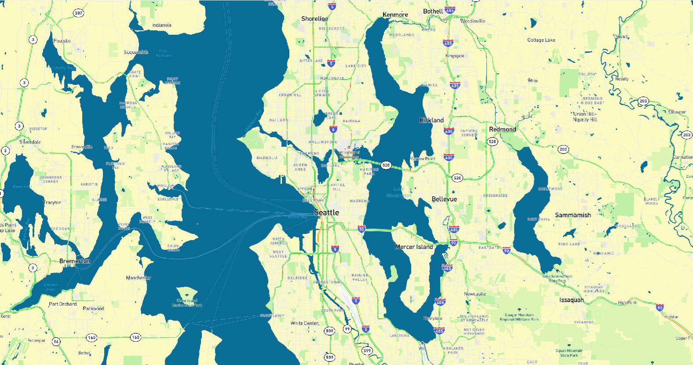
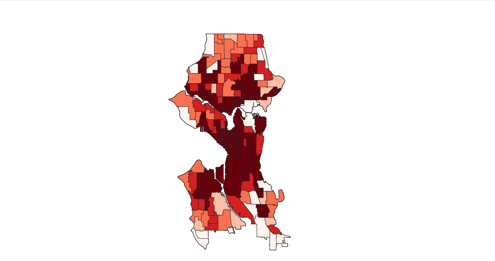
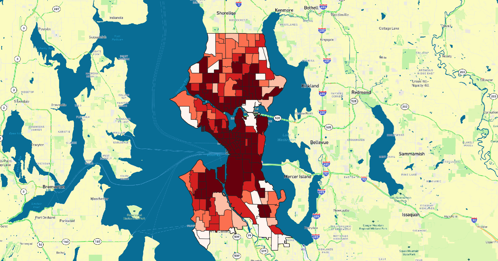
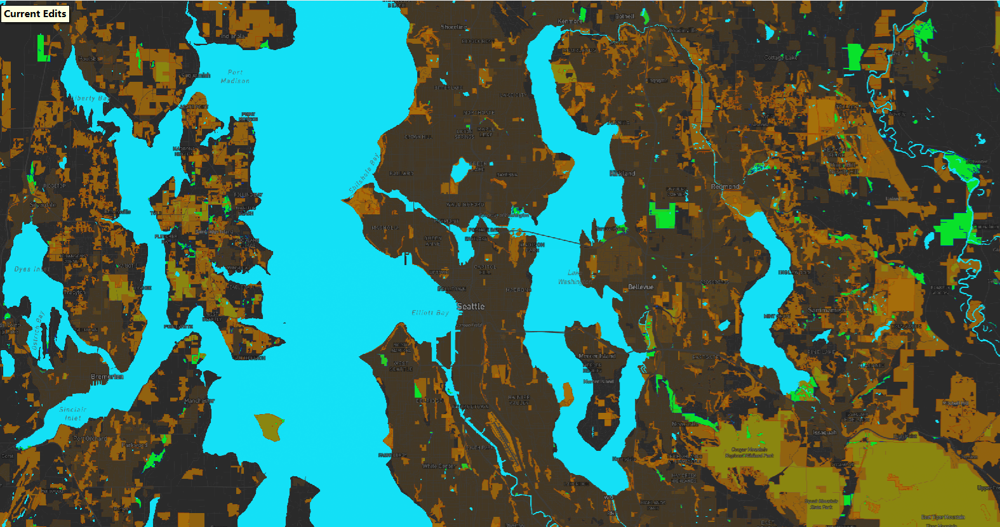

# Web Map Tile Set Project

## Web Map URL
Access the web map here:  
👉 [Seattle Urban Analysis Map](https://Lily-Liu61.github.io/tileset_map/)

---

## Examined Geographic Area
This project focuses on the **Seattle metropolitan area**, including the city of Seattle and its surrounding neighborhoods.  
The map explores spatial patterns and environmental characteristics within this region.

---

## 🧱 Tile Sets Overview

### Tile Set 1: Base Map
- **Type:** Basemap
- **Description:**  
  This is a custom base map created in Mapbox, which generally illustrates the geographical background of the area studied in this lab.
- **Zoom Levels:** `minzoom: 11`, `maxzoom: 15`

📸 **Screenshot:**  

---

### Tile Set 2: Choropleth Map
- **Type:** Thematic layers created from my own geospatial datasets.
- **Description:**  
  This is a choropleth map showing rent prices by census tract. Darker colors represent higher rent prices.
- **Zoom Levels:** `minzoom: 11`, `maxzoom: 15`

📸 **Screenshot:**  

---

### Tile Set 3: Combine of Layer1 and Layer2
- **Type:** Basemap + Chorepleth Map
- **Description:**  
  This is a map created by overlaying my thematic layer onto my base map.
- **Zoom Levels:** `minzoom: 11`, `maxzoom: 15`

📸 **Screenshot:**  

---

### Tile Set 4: Environment
- **Type:** The map layers designed on Mapbox reflect a map theme related to my research interests.
- **Description:**  
  This map shows the national parks, water bodies, and land use areas of the target region. The green areas represent national parks, the blue areas represent water bodies, and the brown areas represent land use areas.
- **Zoom Levels:** `minzoom: 11`, `maxzoom: 15`

📸 **Screenshot:**  

---

## 📊 Summary of Zoom Levels

| Tile Set | Min Zoom | Max Zoom |
|--------|----------|----------|
| Tile Set 1 | 11 | 15 |
| Tile Set 2 | 11 | 15 |
| Tile Set 3 | 11 | 15 |
| Tile Set 4 | 11 | 15 |

---
